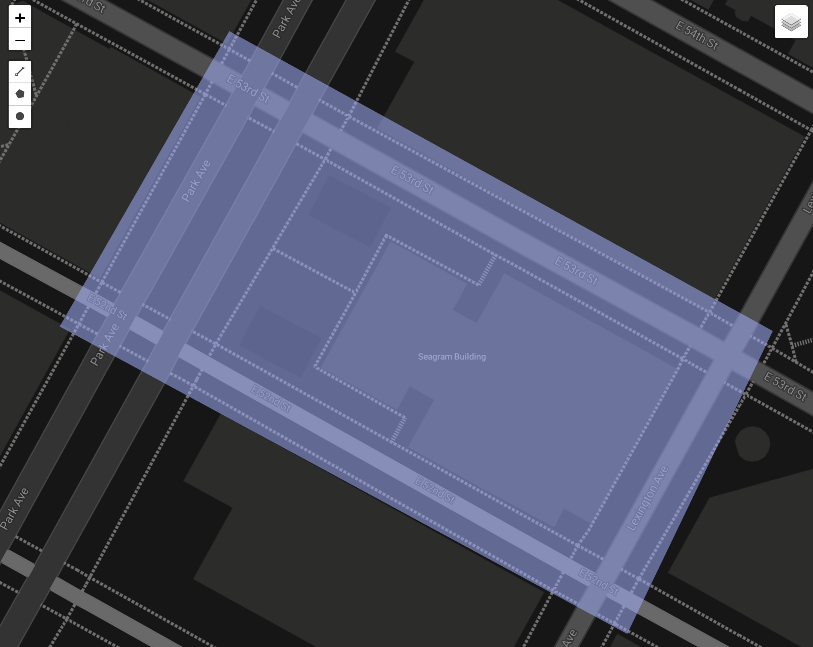
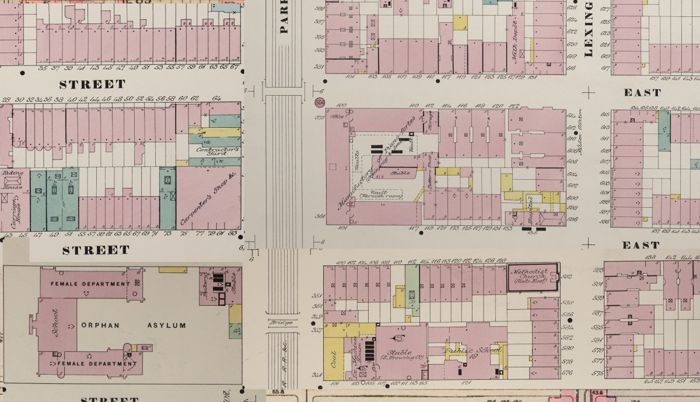
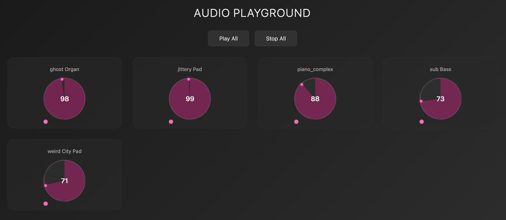
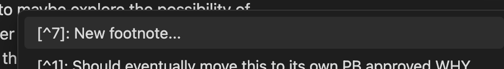
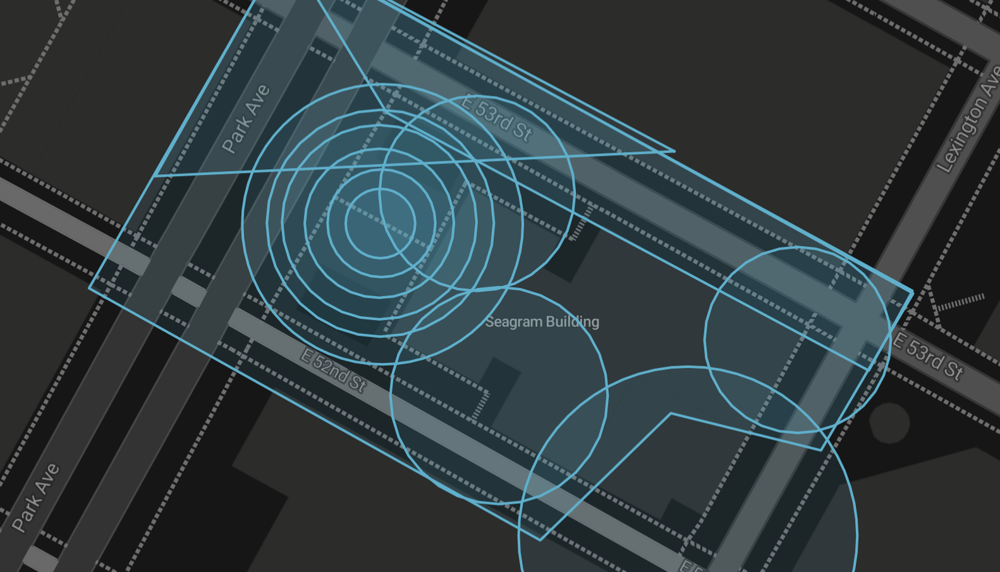

# Process Journal

## 09.23.25 | Beginning Statement[^1]

The general idea here is a more ambiguous, experiential, and non-linear experience than [An Invitation to Play](https://www.mouseandthebillionaire.com/aitp/) While that soundwalk was successful in what it set out to do (namely foster a playful attitude through the medium of soundwalk), it felt a little too... stuffy? It worked really well to use Echos in a linear way (go from area one to area two, trying to set an ideal speed), and was very much in line with a Cardiff-influenced walk, but it definitely felt like trying to choreograph a hidden ballet of cats. Additionally, the linear/prescriptive nature felt very restricting, especially as I move towards thinking more about the contemplative aspects/potential of soundwalks for the [Aesthetics of Contemplative Play](https://github.com/mouseandthebillionaire/planetVelocityMap) thesis work.

At ICMC, I was especially taken with Christina Campanella's [Traces](https://explore.echoes.xyz/collections/6UbRIosluXC02wMw). The composing is excellent, but also the way that the sounds come in and out and interlace with each other is really quite nice. This new piece is going to be highly inspired by Christina's piece. Additionally, recognizing the way that less obvious sound presentation could contribute to a contemplative experience, created some ideas for possible presentation. Eventually I settled on the idea of overlaying a number of complex sounds (narration, field-recording, music) over a given area. I decided on the Seagram building's block in NYC (52nd to Lex to 53rd to Park) because of the potential history there as well as my own personal connection to the building and area. 

With all this in mind, the stated goals for this project are:
- Ambiguous sounds - maybe it isn't even possible to discern what the stories are about, or maybe they only get louder if you stay in one position for long enough, actively choosing with your body what to focus on by keeping still
- Overlapping music motifs that are co-composed through spatial movement
- Non-linear - the participant can walk in any direction around the block, (maybe even zig-zagging, back and forth, cutting through courtyards) and the piece will work
- Non-directive - no 'presenter's voice' telling them where to go or what to think about
- Trying to capture the depth of a space - it's history, culture, etc - through the variety and wealth of sounds presented
- Experiential spatial storytelling - the participant might not know the full extent of the story presented, but through the experience has gleaned some aspect

There's a lot here. First steps will be to come up with a list of potential sonic cues/items. Next.
## 09.24.25 | Initial Ideas

A quick list of things that come to mind as possible sound cues:
- Brent taking about the closing of the Four Seasons and the subsequent auction 
- [that 99pi story about the Citicorp building](https://99percentinvisible.org/episode/structural-integrity/)
- Interviews with doormen
- Audio from [The Social Life of Small Urban Spaces](https://www.youtube.com/watch?v=5QkJkT3M-Us)
- Field recordings
- Audio from St Patrick's (choir, mass, etc)
- A sonic art-piece in the Seagram courtyard (in the places that they display art)
- Snow, different weather in general
- Holiday sounds
- Tenements / Residential sounds
- Racket Club
- Grand Central
- The story of Andy and I sitting on the median
- Lever House

Next step is to do some deep research to find out what exactly had been on the block over the last 500 years. I will experiment with leveraging ChatGPT Pro to help in the data collection, which will hopefully lead to some interesting finds. This will then of course inform new ideas for possible sounds.

## 09.26.25 | Research

Using ChatGPT Pro I got a full [research report](Research.md) on the history of the Seagram block (which for the record, is officially known as Tax Map Block 1307[^2]), and there is so much fun stuff in here. 

Some highlights:
- the [Mannahatta/Welikia] project describes any block in the NYC area from pre-development and Indigenous context
- At that time it was an appalachian oak-hickory forest that most likely served as a hunting ground for the Lenape people
- The forest was home to 12 mammal species (squirrel, cottentail, schrew, beaver, white-tailed deer, raccoon, etc) and 28 bird species (red-tailed hawk, jay, crow, robin, towhee, wild turkey, wren, etc) This is obviously great content for a 'forest sounds' section of the walk
- The New York & Harlem Railroad 4th avenue train line ran down Park (then called 4th) from ~1830 to 1888
- The Steinway & Sons finishing manufactory was there from 1860-1910
- The Steinway family owned townhouses along 52nd on the lot from 1863 to the early 20th century
- The [Montana Apartments](http://www.beyondthegildedage.com/2012/02/montana-apartments.html) replaced the Steinway factory and was there from 1912-1956 when the Segram building was built
- From 1912-1915 the YWCA was at the SW corner of Lex and 53rd and housed the first public swimming pool in New York State

There's tons of linked out maps and resources which are going to be really fun to go through. Some initial thoughts from looking at the maps:
- There is a [St. Zita's Home](https://en.wikipedia.org/wiki/Ellen_O%27Keefe) listed on Plate 78 of the 1923 [Bromley "Land Books"](https://digitalcollections.nypl.org/items/cc464800-45a0-0132-628a-58d385a7bbd0?canvasIndex=0)[^3] in addition to the YWCA, meaning that there was a pretty big presence of caring for women on this particular block.
- The [Sanborn Fire Insurance Map](https://www.arcgis.com/apps/instant/interactivelegend/index.html?appid=9057c35cdabe4c57b821aac42fa33d1f)[^4] from 1892 shows the Steinway manufacturing but also stables in the middle of where the plaza is now, a hospital (which I can't find any other record of), and a carpenter shop across on the SW corner of Park and 52nd
- [This Map from 1854](https://digitalcollections.nypl.org/items/4690ca20-c603-012f-4a1b-58d385a7bc34?canvasIndex=0) shows that the space was stables for the 4th Avenue Stagecoach (!!) Line [^5]
- This is a legit rabbit hole

Obviously there's a lot of sound-based stuff that can come out of this research. I think the next steps are to roughly block out which sections are telling which 'story' of the block. After that it'll be time to start composing.

## 12.01.25 | Pick it Up!

Getting back to this after the [Eikon](https://github.com/mouseandthebillionaire/eikon) sprint I did through October and November. 

First thing I did (and it took most of the day) was piece together these three maps from 1857, 1892, and 1923.

It's interesting to spend so much time thinking about and looking at these visual representations that no one who experiences the walk is going to see. But it's definitely the important background work for me to get a handle on how I want to lay this out. I think from these composites (which I also have laid out on top of each other in a PSD file) I will create my own map of what sounds are going to go where and then start recording/gathering.

Additionally, I have been recently [listening](https://caroline.bandcamp.com/album/caroline-2) to a [bunch](https://matmos.bandcamp.com/album/metallic-life-review) of [albums](https://worldofechomusic.bandcamp.com/album/l-uten-der-seele-unterhaltungen-mit-larven-und-berresten) that have interesting uses of found sound / musique concrete / sound collage vibes, and I think that is influencing the initial sonic goal for this. Namely, I am imagining this more as a musical composition where the different disparate effects are come in and out in a (somewhat) coherent way, focusing on the musicality of the entire experience. In other words: an interactive sound collage VS traditional soundwalk. Should be a fun thing to work on.

## 12.05.25 | Sonic Playground

As I was preparing for my meeting with PJB yesterday, I began thinking about the difficulties of sharing the audio process away from the utility (or really with anyone who isn't intimate with the project/process) Maybe difficulty is too strong a word. Missed opportunity for feedback? Complication? Anyway, I thought it might be interesting to build an online mixer version of how I deal with these tracks in Ableton Live, so I [knocked something together real quick in Cursor](https://mouseandthebillionaire.github.io/1307/Playground/). They're already getting mixed down to their stems for the final project, why not put them in something that an outside participant can then play with in a fairly intuitive way.[^6] Not sure how useful this will actually be in practice (or how far I want to push it - I already have a ton of ideas of where it could go), but it's a super low overhead to copy the tracks to the folder for this web app so at the very least I will continue to do so as I work on the audio. This should also give us a more-easily accessible historical record of where the soundscape was throughout the project, which feels like a plus.

Next:
* Start gathering non-musical audio based on the research and ideas from earlier. Might be a good idea to do a roundup journal entry to list these out as I'm thinking about what to gather.
* Keep filling out the soundtracky musical bit. I would like to maybe explore the possibility of some sort of progression throughout the space. So, rather than _adding_ instruments like I did for [An Invitation to Play](https://www.mouseandthebillionaire.com/aitp/), the (core) instruments remain the same, but their _parts_ change? Or perhaps a combination of both?
* Specifically for the piano, I would like to build a series of concentric circles of tracks within the Seagram building plaza (where the piano manufacturing actually happened) and have them build on each other so that: inner circle = most complex and as you move further from that epicentre the notes drop away (maybe even to a single repeating note?) This involves separating out the existing midi information to multiple tracks (which is a bit of a pain, admittedly) but I could also just try rerecording something into a few tracks and see what serendipitous sounds come out.

Side note: I don't know if it's an Obsidian update or one of the plugins I installed for thesis and/or analysis work, but footnoting has gotten supercharged and is a real joy.[^7]

## 12.07.25 | Sound Thinking

Spending a few minutes today organizing my thoughts and getting all the sounds I need in a list.

- Social life of small urban spaces audio (maybe watch this with the kids, just for fun)
- The sound of snow / the sound of rain (would be better to eventually have it from a given location (like I did in Boston) but for now, maybe just generic "city" rain, snow, crowds (far off parades?), etc)
- Sounds of tenements (should be able to find something for this in the [Internet Archive](https://archive.org/details/movies?tab=collection&query=nyc+tenements)
- Swimming pool
- Record the story of Andy and I (again, would be better if I could get Andy to do it. I'll see if I can get a voice note)
- Animals
	- Squirrel
	- Schrew
	- Beaver
	- Cottentail (do they make sounds?)
	- Beaver
	- Red-tailed hawk
	- Jay
	- Robin
	- Towhee
	- Wild turkey
	- Wren
	- Horse stables
* Sounds of a river/stream (old maps show a river bend was right at this spot)
* 1830-1888 era railroad sounds (what would that sound like? What kind of trains would they have used?)
* 1912-1956 era apartment building sounds
* Four Seasons sounds? (is there anything useful [here](https://www.youtube.com/results?search_query=four+seasons+restaurant+new+york) - this [Martha Stewart and Julian Niccolini "tea"](https://www.youtube.com/watch?v=CuM-N3ejUOo) is pretty great)

PS - Happy [St. Tom's Day](https://www.youtube.com/watch?v=vGpwgHqlfWo&list=RDvGpwgHqlfWo&start_radio=1) to those who celebrate

## 12.09.25 | Planning

Started gathering sounds and found myself falling down a bit of a rabbit hole asking questions like:

- "What was the size, exactly, of the room with the YMCA swimming pool? That would change the reverberations, obviously!"
- "Were kids allowed in the YMCA swimming pool? A lot of these samples I'm finding have kids in them!"
- "Do apalachian oak-hickory forests sound different than these forests I'm finding audio from in West Virginia?!"
- "Are these insect sounds true to the time period!?"
- "Does a Towhee from Manhattan have the same accent as a Towhee from Maine!?"
- "What train exactly ran down the 4th avenue train line!?"

This culminated in me looking up all these questions and eventually doing [deep-dive research with ChatGPT](Rsearch.md/#train-soundscape-research--120825) to ascertain exactly what train would have been running down the line and how its whistle varies from the more common one we hear in classic Westerns.

Now. This is all fine and good. In fact, this is probably worthwhile for the project, since part of the point is to share a robust and accurate history of a given space.

BUT, as far as testing for this weekend? Not necessary! So, I'm regrouping a bit here and planning on what I actually need to get into the Echos prototype over the next few days. Mainly, I want to use this as an experiment to test wether these sounds coming in and out makes sense (and is a pleasant experiment) so the non-localized sound effects that I have sound will work perfect for that. 

Additionally, I used Claude to build a tool that splits up the complicated piano midi file into (now) six different files which, once combined, gives the whole track. I want to put these into the concentric circles and see if this works like I hope it will.[^8]

Here we go.

## 12.11.25 | Walking Test

I've got the first version up on Echoes and will be testing it in NYC this weekend. There's not quite as much _musical_ stuff happening here, but I'm hoping that doing the cycle a few times will give me some ideas for where to take it next. I'm also bringing my mic so I can do some field-recordings. I think that these will be standing still (rather than the Cardiffian-style walking recordings that I did for the Boston soundwalk). I like the idea of discrete stops along the way that present the space as it sounds at certain times of day/year/eras. What if this was a living document that I came back to every decade or so, recording the sound of the block at that specific time?

## 12.09.25 | Planning

Started gathering sounds and found myself falling down a bit of a rabbit hole asking questions like:

- "What was the size, exactly, of the room with the YMCA swimming pool? That would change the reverberations, obviously!"
- "Were kids allowed in the YMCA swimming pool? A lot of these samples I'm finding have kids in them!"
- "Do apalachian oak-hickory forests sound different than these forests I'm finding audio from in West Virginia?!"
- "Are these insect sounds true to the time period!?"
- "Does a Towhee from Manhattan have the same accent as a Towhee from Maine!?"
- "What train exactly ran down the 4th avenue train line!?"

This culminated in me looking up all these questions and eventually doing [deep-dive research with ChatGPT](Rsearch.md/#train-soundscape-research--120825) to ascertain exactly what train would have been running down the line and how its whistle varies from the more common one we hear in classic Westerns.

Now. This is all fine and good. In fact, this is probably worthwhile for the project, since part of the point is to share a robust and accurate history of a given space.

BUT, as far as testing for this weekend? Not necessary! So, I'm regrouping a bit here and planning on what I actually need to get into the Echos prototype over the next few days. Mainly, I want to use this as an experiment to test wether these sounds coming in and out makes sense (and is a pleasant experiment) so the non-localized sound effects that I have sound will work perfect for that. 

Additionally, I used Claude to build a tool that splits up the complicated piano midi file into (now) six different files which, once combined, gives the whole track. I want to put these into the concentric circles and see if this works like I hope it will.[^8]

Here we go.

## 12.11.25 | Walking Test

I've got the first version up on Echoes and will be testing it in NYC this weekend. There's not quite as much _musical_ stuff happening here, but I'm hoping that doing the cycle a few times will give me some ideas for where to take it next. I'm also bringing my mic so I can do some field-recordings. I think that these will be standing still (rather than the Cardiffian-style walking recordings that I did for the Boston soundwalk). I like the idea of discrete stops along the way that present the space as it sounds at certain times of day/year/eras. What if this was a living document that I came back to every decade or so, recording the sound of the block at that specific time?

## Notes

[^1]: Should eventually move this to its own PB approved WHY document, but for now this feels like a good place to start the WHY juices/conversation flowing)

[^2]: Which would be a great name for the piece maybe? Block 1307. Even just 1307. Can you change the names of projects on GitHub? Probably, yeah?

[^3]: Lionel Pincus and Princess Firyal Map Division, The New York Public Library. "Plate 78: [Bounded by E. 53rd Street, Third Avenue, E. 47th Street and Fifth Avenue]" New York Public Library Digital Collections. Accessed September 26, 2025. https://digitalcollections.nypl.org/items/cc464800-45a0-0132-628a-58d385a7bbd0

[^4]: Sanborn Fire Insurance Map from New York, Bronx, Manhattan, New York. Sanborn Map Company, - 1902 Vol. 4, 1899, 1899. Map. https://www.loc.gov/item/sanborn06116_004/.

[^5]: I don't know what happened, but as of 12.01.25 I can NOT find this image anymore. All the maps from this archive now stop at 42nd... (follow-up: I wonder if I was mistaken and the city doesn't actually have maps that go that far north. There _does_ seem to be a stable at 34th (which is the map I do have in my documents folder))

[^6]: Strangely enough, this ends up being really similar to the [Auldvent](https://www.mouseandthebillionaire.com/auldvent/) project that I built last year

[^7]: See!

[^8]: It is not working in the Playground tool right now, which is a bummer, but, again, a problem for another day
